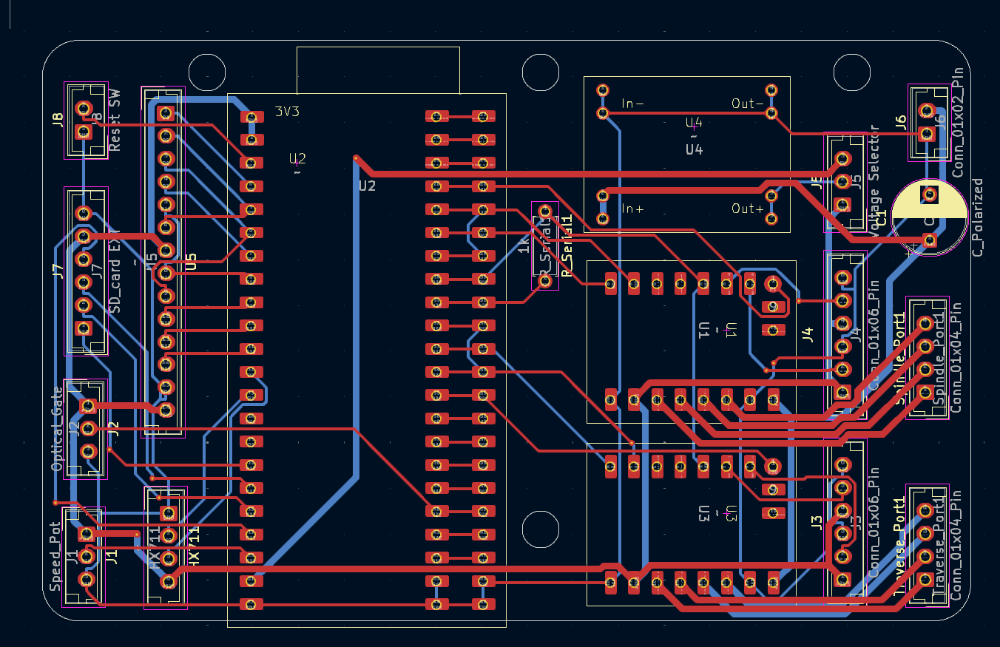

# IN PROGRESS

## Warning
Let's just get this out of the way. This is NOT a project for the faint of heart. A combination of mechanical aptitude, pinning electrical connectors, and a 3D printer are required to execute.
If you want a less advanced yet still capable version. Try the V2 winder based on commonly avaliable RC components.

With that out of the way. Let's begin.

## Background

On some level, this build is not so much an evolution, but a return to the original plan.
See, the very first computerized winder I had attempted used a pancake stepper and 12V power. But due to problems integrating the servo control and stepper libraries, this was quickly abandoned in favor of hobby RC components.
Now, with years more experience, and a better understanding of my inital failures, i'm back to make my ultimate CNC winder!

Heres the intended improvements.

* Increased Precision:

    The previous winder design utilized RC servos for traverse control. While this worked well, there are three major failing points.
    * 1: The servo has some measure of backlash, negating some precision.
    * 2: Using just the servo horn for traverse means complex Rotation-Linear position math.
    * 3: The largest failure. The servo traverse can only be controlled in 1 degree increments. With a 10mm arm length, this is 0.2mm per step.  Not precise enough for laying 42 gauge wire side by side.

    The new design uses a 2mm pitch lead screw, with 16 part microstepping. Or 3200 steps per revolution Which results in Linear precision of 0.000625mm.
    10X the required precision for layer to layer position of 44AWG wire (0.058mm with insulation). 

* Tension Measurement:
    A weakness of all previous designs was a reliance on "eye-caliper" measurements for tension. Otherwise known as trial and error.
    And knowing when the wire was close to it's breaking point was all but impossible. 
    To fix this problem, A HX711 chip paired to a 0-100g load cell was added for tension measurement. At minimum this provides a warning for break tension.

* Complete Offline Running:
    While previous versions were relatively easy to use. They were required to be connected to a computer for parameter adjustment.
    Perfectly acceptable for a hobbyist builder, With Arduino IDE being easy to access. But this is still less than ideal, and certainly not up to being an "ulitmate" winder.

* Preset and parameter Storage:
    This is part of the previous problem. While presets could be loaded into IDE and then selected via a selectable parameter in code. This still required modification to the code files any time a new pickup was desired.
    This new winder incorporates a small touch screen to allow parameter editing, and multiple presets than can be tweaked before deployment. (say a 5% underwind while maintaining all other specifications).

## Mechanicals
The core mechanical parts are composed of:
* Nema 17 Stepper full size motor. (Spindle Direct Drive)
    * Connected to 5mm flange adapter 
* Nema 17 Pancake Stepper motor (Traverse, could use full size here)
    * Connected to 8mm x 2 leadscrew with flexible coupler
    * Screw rides in two 8mm ID flange bearings
    * Traverse guide with anti-backlash nut, and 5mm guide rod with 5mm bushing

* Tensionser is a pair of felt Hi-Hat washers with bolt through center
* Tension meter is HX711 connected to a 0-100g load cell.
* Guides are cut from HDPE sheet. Future iterations may upgrade to PTFE guides as required.

Design notes:
While the position of most of the guides is somewhat critical. The one that matters the most is the final guide before the bobbin. Previous iterations placed this guide on top of the linear guide rail, not the lead screw. However, even with the guide bushings, the traverse carrier has some play over the guide. so during direction switches the accuracy would go down.
With the guide positioned over the screw, the maximum precision is reached as all backlash is taken up by the nut, and the guide over the rail is simply a direction change post.

Previous considerations used a 3 point tension meter setup, but in practice this is unnessecary. And ultimately made threading the guides more difficult. Use a small weight of known mass and calibrate the scale factor.

With the current design, alignment of the different components is challenging. In the future, incorporating the stepper and carrier brackets would be preferable, as well as a thin baseplate to align all the separate brackets.

Tension accuracy might be questionable.  With each individual guide a small amount of friction is added, but the exact quantity is unknown.

## Electricals
* Custom made Connection PCB populated with 
* 2x TMC2209 Stepper motor drivers
* Linear Voltage regulator breakout
* Esp32 S3 devkit Microprocessor
* HX711 Load cell amplifier
* SPI connected 2.4" touchscreen
* Connections made via JST connectors.
* 24VDC Power Supply

Design Notes:
As previously touched upon. Previous iterations ran off of either an Arduino Nano or ESP32-Wroom. And lacked any meaningful interface aside from a speed control knob.
This new system adds the most powerful ESP32 available, and controls the steppers via modifiable hardware timers, allowing for pinpoint precision. 
The new stepper drivers are linked by the single channel UART communication. This allows for programming the microsteps and current limits in the code, no need for jumpers. However, there are also two open 6 port connectors designed to control microstep jumpers if needed.

Currently there is a provision to add a SD card, external reset switch, and an optical gate. The SD card port could also be used for some sort of sensor. The optical gate is currently connected to a limit switch instead of an optical gate. The original plan was to use a function in the 2209 to set zero, but this failed.

One step "backward" is the system no longer has a closed loop feedback on the spindle. However in practice no steps are dropped. and from experience if enough torque to drop a step is encountered, the stepper will drive backwards and ruin the bobbin anyways. So closed loop control is an unnessecary extra. 

There is currently an Error in the spacing of the microcontroller pins. The wider spaced outline fits correctly, however the narrow spacing, designed for a narrower S3 board, is too narrow.

## Interface
(In progress)

## Notes

